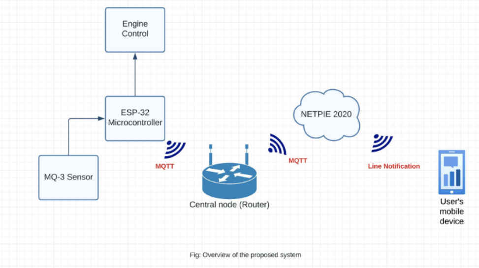
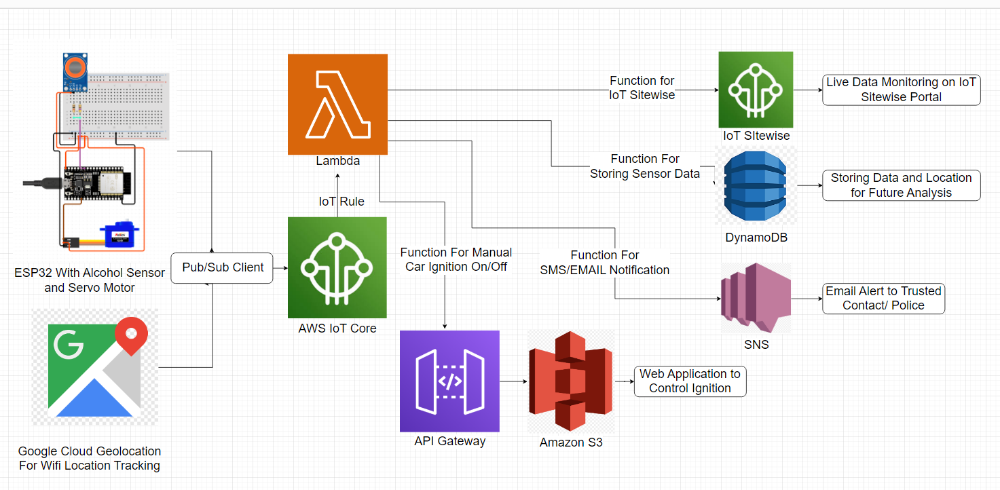
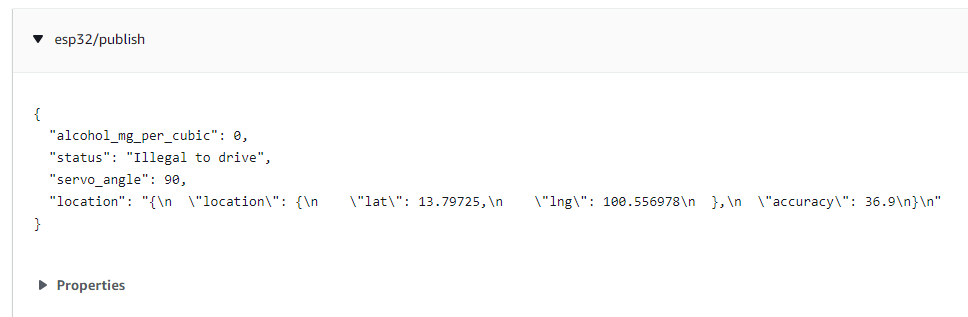
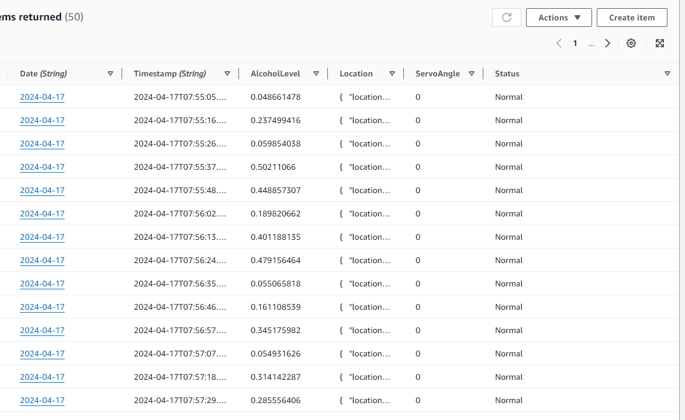
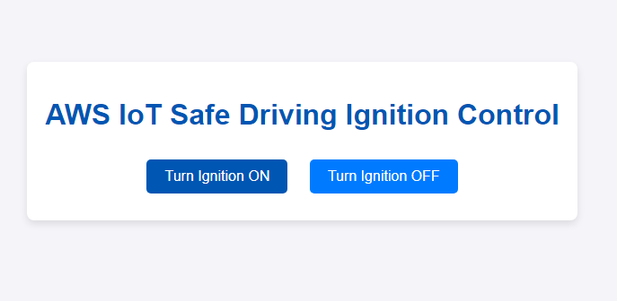
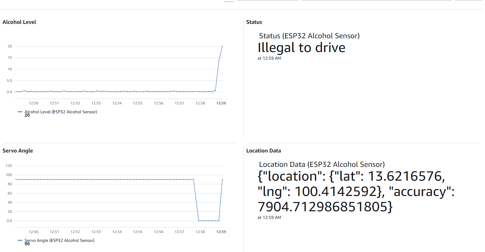
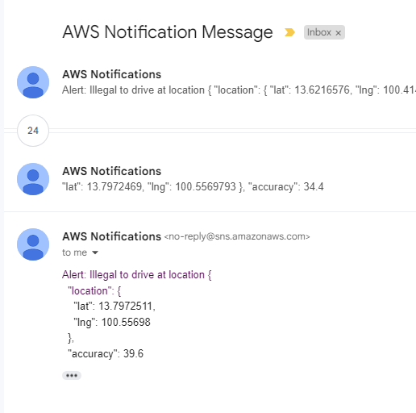
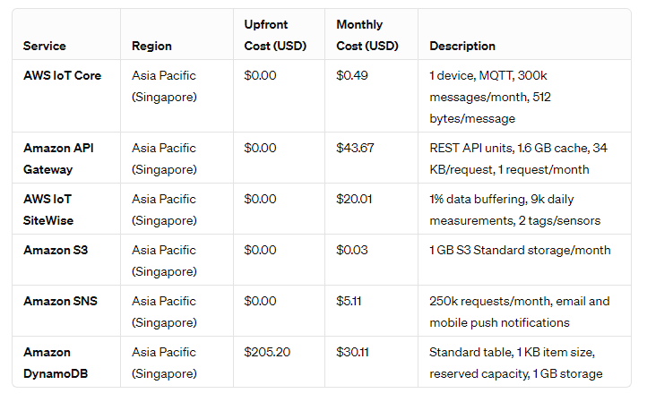

# Real-time Data Integration and Analytics Platform on AWS for IoT Applications

## Cloud Computing - AT 83.03

### Tanzil Al Sabah - ST123845 - AIT IoT

## Background

The Internet of Things (IoT) has dramatically transformed various sectors by enabling the collection and exchange of data from a myriad of connected devices. This transformation is facilitating unprecedented levels of automation, efficiency, and insight across industries such as healthcare, manufacturing, agriculture, and smart cities. As IoT devices proliferate, they generate vast quantities of data that need to be processed and analyzed in real-time to extract actionable insights. This requirement presents significant challenges, primarily due to the volume, velocity, and variety of the data produced.

Cloud computing, with its scalable and flexible resource management capabilities, has emerged as a viable solution to address these challenges. Specifically, AWS provides a comprehensive suite of services that support the development of scalable, efficient, and cost-effective real-time data processing and analytics platforms. However, designing a system that can seamlessly integrate these services to handle the complexities of IoT data in real-time demands a strategic approach and careful consideration of architecture, data flow, and processing logic.

## Problem Statement

Despite the potential of IoT devices to revolutionize data-driven decision-making, several challenges hinder the efficient processing and analysis of IoT data in real-time. These challenges include:

- **Scalability:** Traditional data processing solutions often cannot scale dynamically to accommodate the fluctuating volumes of data generated by IoT devices.
- **Latency:** Many IoT applications require low-latency processing and analysis to deliver timely insights, a requirement difficult to meet with conventional data processing architectures.
- **Data Integration and Management:** The heterogeneity of IoT devices and the data they produce complicates integration and management, necessitating flexible data processing pipelines that can adapt to diverse data formats and sources.
- **Cost:** Efficiently managing the cost of cloud resources while scaling to meet demand is a persistent challenge for real-time IoT data processing platforms.
- **Security and Privacy:** Ensuring the security and privacy of data throughout its lifecycle, from ingestion to analytics, is paramount, especially given the sensitive nature of data collected in some IoT applications.

## Objectives

1. **Design and Implement a Scalable, Real-time Data Processing Platform:** Develop an architecture using AWS services that can dynamically scale to process high volumes of IoT data in real-time, accommodating fluctuations in data volume and velocity.
2. **Achieve Low-latency Data Processing and Analysis:** Ensure the platform can process and analyze data with minimal latency, enabling timely insights and actions for IoT applications.
3. **Facilitate Seamless Data Integration and Management:** Create a flexible data processing pipeline capable of handling diverse data formats and integrating data from various IoT sources, simplifying data management challenges.
4. **Optimize Cost-efficiency:** Implement cost-optimization strategies within the platform to manage the expenses associated with cloud resources, ensuring the solution remains cost-effective at scale.
5. **Ensure Data Security and Privacy:** Incorporate robust security measures and privacy practices to protect data throughout the processing and analytics pipeline, adhering to compliance standards and best practices.

## Literature Review

1. **ClouT: Leveraging Cloud Computing Techniques for Improving Management of Massive IoT Data**
2. **Real-time Data Processing in IoT Networks: Challenges and Opportunities**
3. **Serverless computing for Internet of Things: A systematic literature review**
4. **Enabling privacy and security in Cloud of Things: Architecture, applications, security & privacy challenges**
5. **Real-time analytics on IoT data**

## Methodology

### Phase 1: Design and Architecture

- **System Architecture Design:** Define a scalable, modular architecture incorporating AWS IoT Core for device connectivity, Amazon IoT Sitewise for real-time data monitoring, AWS Lambda for serverless data processing, and Amazon DynamoDB for analytics and storage.
- **Data Flow Mapping:** Outline the complete data journey, from ingestion from IoT devices, through transformation and processing, to analytics and storage, ensuring a clear path for data throughout the system.

### Phase 2: Implementation

- **AWS Environment Setup:** Configure the necessary AWS services, ensuring they are securely integrated and optimized for cost and performance.
- **Data Ingestion and Streaming:** Implement the ingestion process using AWS IoT Core, set up data monitoring with Amazon IoT Sitewise.
- **Serverless Processing Functions:** Develop AWS Lambda functions to process and transform data as it flows through the pipeline, implementing any necessary business logic or data cleansing operations.
- **Analytics and Storage Configuration:** Set up Amazon DynamoDB for storing and analyzing processed data, designing schemas and analytics queries tailored to the project's goals.
- **Web Application:** Static web application on Amazon S3 for controlling ignition.
- **Live Location Tracking:** Due to the limitation of Amazon Location Services for life wifi location tracking, I have used Google Cloud Geolocation to track GPS coordinates of the IoT device.

### Phase 3: Testing, Evaluation, and Optimization

- **Functional Testing:** Verify that each component of the system works as intended, from data ingestion to analytics.
- **Performance and Scalability Testing:** Conduct load testing to evaluate the system's performance under varying data volumes and processing demands, adjusting configurations as needed for optimal scalability.
- **Cost Evaluation:** Monitor and analyze the costs associated with running the platform, identifying areas for optimization to ensure cost-efficiency.

## IoT System

The former system employs an ESP32 Microcontroller integrated with an MQ3 Alcohol Sensor and a Relay module to detect alcohol levels in breath. Programmed for synchronized functioning, it showcases results on the NETPIE Dashboard and sends notifications. If alcohol levels exceed a predefined threshold, it prevents the vehicle's engine from starting. Additionally, a push button is incorporated to activate the sensor or reset the system. For the real-time analytics project initially envisioned to use NETPIE for dashboarding and notifications, transitioning to AWS services can enhance scalability, security, and integration capabilities, particularly for IoT applications.

## System Diagram of IoT based Alcohol Detection System (Old System)

## Transition to AWS

### AWS IoT Core:

- **Device Integration:** ESP32 connects to AWS IoT Core, enabling secure communication between the IoT device and AWS cloud services.
- **MQTT Protocol:** Utilizes MQTT messaging protocol for lightweight, real-time communication of sensor data.

### Amazon IoT Sitewise:

- **Real-time Data Monitoring:** Monitors sensor data in real-time, facilitating immediate analysis and decision-making processes.

### AWS Lambda:

- **Event-driven Logic:** Processes incoming data from Amazon Kinesis, executing logic based on alcohol level detection (e.g., comparing against threshold levels).
- **Control Commands:** Sends commands to activate the relay module to prevent engine start-up if necessary, through AWS IoT Core.

### Amazon DynamoDB:

- **Data Storage:** Stores historical data of alcohol level readings for further analysis or auditing purposes.

### Amazon SNS (Simple Notification Service):

- **Alerts and Notifications:** Sends real-time alerts or notifications to relevant stakeholders if alcohol levels exceed the predefined threshold.

## System Operation

- When the push button is pressed, the ESP32 activates the MQ3 Alcohol Sensor.
- If alcohol is detected above the threshold level, the system prevents the vehicle’s engine from starting by changing the Servo Angle.
- Real-time GPS Location tracking by using Google cloud Geolocation.
- Sends real-time data to AWS IoT Core, which is processed and analyzed through AWS Lambda.
- Triggers an Amazon SNS notification to a predefined contact list.
- Logs the event in Amazon DynamoDB for record-keeping.
- Real-time Data Monitoring and visualization on Amazon IoT Sitewise.
- Static Web Application on Amazon S3 to manually control the ignition.

## Benefits of using AWS compared to Netpie

In the exploration of cloud platforms suitable for IoT applications, an analysis was conducted comparing AWS (Amazon Web Services) IoT Core and NetPIE. This comparison sought to understand the capabilities, scalability, security measures, and integration potential of each platform, highlighting the areas where AWS IoT Core often surpasses NetPIE, particularly for projects with extensive scalability and complex integration needs. The findings are presented from a passive assignment submission perspective, emphasizing the inherent strengths of AWS IoT Core in various dimensions.

### Scalability and Reliability

The investigation revealed that AWS IoT Core is inherently capable of supporting a significant scale of operations, accommodating billions of devices and trillions of messages effortlessly. Its infrastructure is designed for high availability and redundancy, crucial for the rapid scaling of IoT applications. In contrast, while NetPIE is adept at handling many applications, its scalability does not parallel the enterprise-level capabilities offered by AWS.

### Integration with Cloud Services and Ecosystem

AWS IoT Core's seamless integration with a broad array of AWS services stands out as a significant advantage. This integration facilitates the development of complex IoT solutions that can leverage advanced analytics, machine learning, and storage services directly within the AWS ecosystem. On the other hand, NetPIE, although it offers integration capabilities, lacks the extensive ecosystem provided by AWS.

### Security

The analysis highlighted the robust security features of AWS IoT Core, including mutual authentication, fine-grained authorization, and encryption, both at rest and in transit. The comprehensive and continuously audited security model of AWS IoT Core provides a level of security assurance that is paramount for IoT projects, especially those handling sensitive data.

### Developer Tools and Community Support

The vast AWS developer community and the plethora of documentation, tutorials, forums, and professional support options available were identified as significant benefits. AWS offers IoT-specific developer tools that facilitate device management, simulation, and testing, advantages that are less pronounced with NetPIE due to its smaller scale community and support resources.

### Global Infrastructure

For projects targeting a global audience, AWS IoT Core's extensive data center presence around the world offers a strategic advantage, enabling localized data processing and adherence to regional data privacy regulations. This global infrastructure is a critical factor for applications requiring low latency and compliance with local data laws, areas where NetPIE may not provide the same level of support.

### Cost and Pricing Model

While AWS IoT Core operates on a pay-as-you-go pricing model, offering cost-effectiveness at scale, careful management of resources is required to optimize expenses. The transparency in AWS pricing aids in effective planning and cost management, an aspect that may be more straightforward with NetPIE's pricing structure, particularly for smaller or initial-stage projects.

## System Architecture

### ESP32 with Alcohol Sensor and Servo Motor

The core hardware includes an ESP32 microcontroller connected to an alcohol sensor (MQ-3) and a servo motor. The alcohol sensor detects the presence of alcohol, and the servo motor can be used to enable or disable the car ignition.

### Google Cloud Geolocation for WiFi Location Tracking

The system uses WiFi scanning to detect nearby networks and sends this data to Google's Geolocation API to obtain the location of the device.

### AWS IoT Core

The ESP32 communicates with AWS IoT Core via MQTT protocol, establishing a secure connection using certificates. IoT Core is central to the AWS IoT services, enabling secure communication between connected devices, cloud applications, and other devices.

### Pub/Sub client

Refers to the publish/subscribe model where the ESP32 publishes data, and subscribers, such as the AWS IoT Core or other services, receive the data.

### Successful Integration of ESP32 and Sensor with AWS IoT Core

### IoT Rule

It is a rule that filters, transforms, and triggers actions based on MQTT messages and works as a bridge between IoT core and Lambda.

### Lambda Functions

Several Lambda functions are used here. One is used for controlling the car ignition through an API Gateway. It publishes a message with the desired servo angle to the MQTT topic esp32/control. Another Lambda function processes incoming data, potentially logging it to DynamoDB and sending an alert if the alcohol level is above a threshold. Another has been utilized to display and monitor live sensor data and location data on IoT Sitewise portal.

### API Gateway

It acts as an intermediary that triggers the Lambda function in response to HTTP requests.

### DynamoDB

It stores sensor data and location information for future analysis.

### Amazon S3

S3 is used to host the web application.

- [Web Application on Amazon S3](https://iot-bucket-tanzil.s3.ap-southeast-1.amazonaws.com/index.html)

Figure shows a simple web application hosted on S3, It can be used by Local Police or Trusted contact to stop the ignition of the car. Once Ignition is off, it can not turn on automatically until the system is rebooted or the ignition on button is pressed. 

### IoT Sitewise and Sitewise Portal

This service is used for monitoring, visualizing, and analyzing industrial IoT data at scale. The portal provides a web-based user interface to view live and historical data.

### SNS (Simple Notification Service)

When certain conditions are met (e.g., high alcohol concentration), an alert will be sent through SNS to a subscribed email or SMS endpoint.

## Alignment with AWS Well-Architected Framework

### Operational Excellence

The project incorporates detailed planning, testing, and optimization phases, ensuring secure and efficient AWS service configuration.
Emphasis on continuous improvement is evident through functional, performance, and scalability testing, alongside cost optimization efforts.

### Security

Security measures are prioritized, especially concerning sensitive IoT device data management, utilizing AWS IoT Core and MQTT protocol for secure device connectivity and messaging.
AWS Lambda and Amazon DynamoDB are employed for secure data processing and storage, adhering to best security practices.

### Reliability

Utilizes AWS IoT Core and Amazon IoT SiteWise for robust real-time data streaming and processing capabilities, essential for handling large volumes of IoT data.
The serverless architecture with AWS Lambda ensures system adaptability to demand changes without manual intervention, enhancing reliability.

### Performance Efficiency

The project leverages serverless computing, real-time data processing with Amazon Kinesis, and efficient data storage and analytics with DynamoDB.
The architecture's design for minimal latency in data processing showcases a commitment to maintaining high performance efficiency.

### Cost Optimization

A proactive approach to managing cloud resource costs is highlighted, focusing on identifying and implementing optimization strategies to maintain cost-efficiency at scale.
The adoption of serverless computing contributes to cost optimization by automatically adjusting resource allocation based on demand.

### Sustainability

The project's efficient use of cloud resources and serverless computing indirectly supports sustainability by optimizing resource usage and reducing environmental impacts.

## Cost Estimation

### Maximum Annual and Monthly Cost for AWS Services for One System

#### Estimate Summary

- **Upfront Cost:** $205.20 USD
- **Monthly Cost:** $99.42 USD
- **Total 12 Months Cost:** $1,398.24 USD (this includes the upfront cost)

#### Detailed Estimate Breakdown

- **AWS IoT Core:** Monthly Cost: $0.49 USD
- **Amazon API Gateway:** Monthly Cost: $43.67 USD
- **AWS IoT SiteWise:** Monthly Cost: $20.01 USD
- **Amazon Simple Storage Service (S3):** Monthly Cost: $0.03 USD
- **Amazon Simple Notification Service (SNS):** Monthly Cost: $5.11 USD
- **Amazon DynamoDB:** Upfront Cost: $205.20 USD, Monthly Cost: $30.11 USD

- **Google Map Geolocation API:** Since Google Geolocation provide 200 USD Free tier every month, that should be enough for one system.

- **Additional Costs incurred so far:**
  - ESP32: $4 USD
  - MQ3 Sensor: $3 USD
  - SERVO Motor: $1 USD

## Conclusion and Future Work

This project demonstrates the effective integration of IoT devices with AWS services to create a scalable, real-time data analytics platform, using an alcohol detection system as a prime example. The adaptability and efficiency of this approach highlight its applicability across various IoT applications, from environmental monitoring to smart homes and healthcare.

### Future Work

1. **Expand IoT Device Range:** Explore the integration of additional IoT devices to diversify application fields.
2. **Enhance Data Analytics:** Implement more sophisticated analytics algorithms for deeper insights.
3. **Improve User Interaction:** Develop advanced user interfaces and dashboard features for better data visualization and interaction.
4. **Explore Edge Computing:** Incorporate edge computing to reduce latency and network load for critical applications.
5. **Strengthen Security Measures:** Continuously update security protocols to protect against evolving threats.

## References

- **SECURITY AND PRIVACY FOR CLOUD AND IoT - by Kuo-Hui Yeh, Weizhi Meng, SK Hafizul Islam, Kuan Zhang, Ennan Zhai - University of Nebraska - Lincoln**
- **Real-time Data Processing Using AWS Lambda by Tara E Walker**
- **A Comparative Study of Cloud-Connected IoT Solutions by Durga Prasad Rai and Ramesh Mishra - Avadh University Ayodhya (U.P.)- India**
- **Alcohol Detection System in Vehicle Using Arduino by Deepak Garg, Ayush Kumar Srivastava, Deep Paliwal, Shashank Shekhar, Ashutosh Singh Chauhan**
- **Accident Vehicle Automatic Detection System By Image Processing Technology ©IEEE 1994 - by A.ISuge, H.Takigawa, H.Osuga, H.Soma, K.Morisaki**
- **Vehicle Navigation & Information Systems Conference Paul Baskett, Yi Shang, Michael V. Patterson Timothy Trull, Towards A System for Body-Area Sensing and Detection of Alcohol Craving and Mood Dvs regulation © 2013 IEEE**
